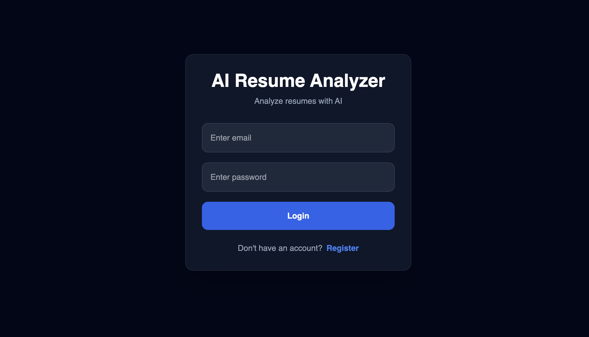
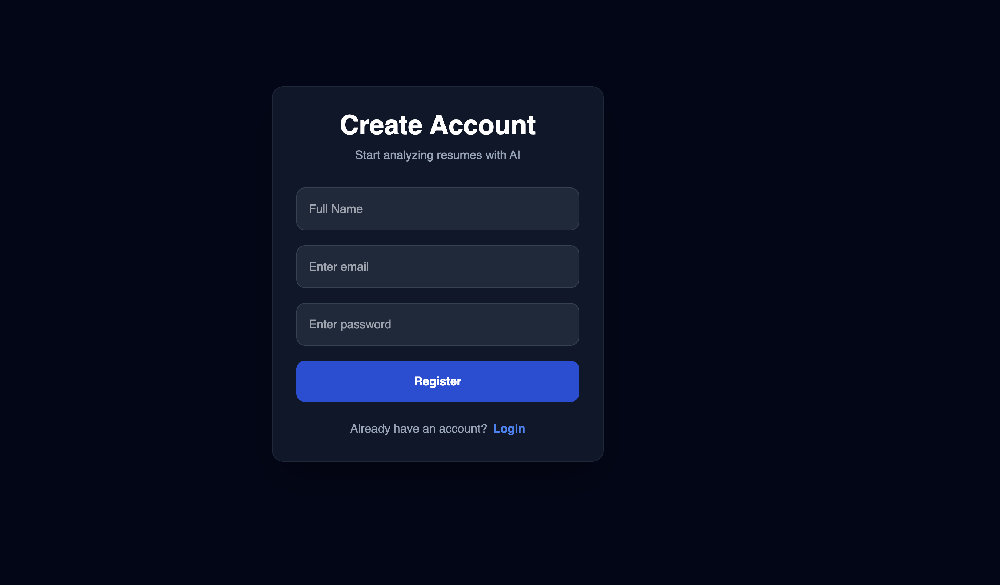
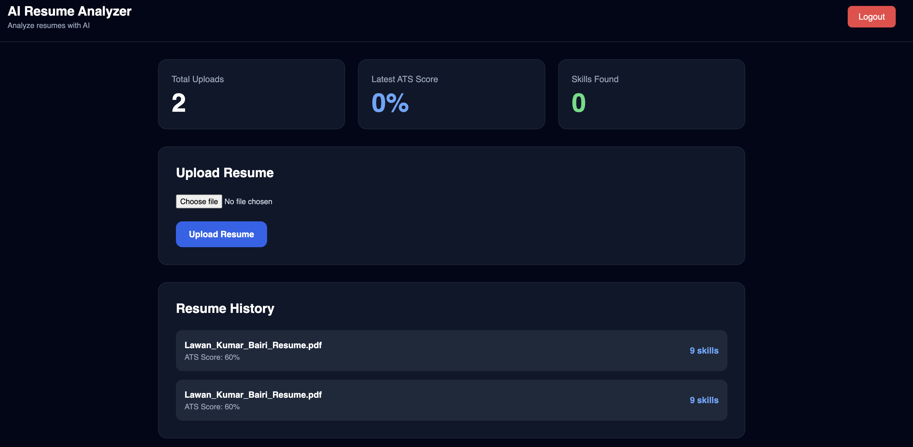
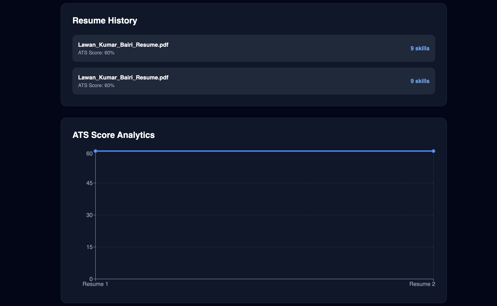

# AI Resume Analyzer SaaS

An AI-powered Resume Analyzer built using React, FastAPI, PostgreSQL, and OpenAI integration.

This application allows users to:

- Register & Login securely
- Upload resumes in PDF format
- Parse resume content automatically
- Analyze ATS compatibility
- Extract technical skills
- Identify missing skills
- Generate AI-powered resume feedback
- View analytics dashboard with ATS score trends

---

# Tech Stack

## Frontend

- React
- TypeScript
- Tailwind CSS
- Axios
- Recharts
- React Router DOM

## Backend

- FastAPI
- PostgreSQL
- SQLAlchemy
- Alembic
- JWT Authentication
- PyMuPDF

## AI Integration

- OpenAI API

---

# Features

## Authentication

- User Registration
- User Login
- JWT Token Authentication
- Protected Routes

## Resume Analysis

- PDF Resume Upload
- Resume Text Parsing
- ATS Score Generation
- Skills Extraction
- Missing Skills Detection
- AI Resume Feedback

## Dashboard

- Resume History
- ATS Analytics
- Score Charts
- Skills Visualization

---

# Project Architecture

Frontend (React)
↓
FastAPI Backend
↓
Services Layer
↓
PostgreSQL Database

---

# Screenshots

## Login Page



---

## Register Page



---

## Dashboard



---

## ATS Analytics



---

# Installation

## Clone Repository

```bash
git clone https://github.com/devlawan/ai-resume-analyser.git```

---

# Backend Setup

```bash
cd backend
```

Create virtual environment:

```bash
python -m venv venv
```

Activate virtual environment:

## Mac/Linux

```bash
source venv/bin/activate
```

## Windows

```bash
venv\Scripts\activate
```

Install dependencies:

```bash
pip install -r requirements.txt
```

Create `.env`:

```env
DATABASE_URL=your_database_url
SECRET_KEY=your_secret_key
OPENAI_API_KEY=your_openai_api_key
```

Run backend:

```bash
uvicorn app.main:app --reload
```

---

# Frontend Setup

```bash
cd frontend
```

Install dependencies:

```bash
npm install
```

Run frontend:

```bash
npm run dev
```

---

# API Endpoints

## Authentication

- POST `/api/v1/auth/register`
- POST `/api/v1/auth/login`
- GET `/api/v1/auth/me`

## Resume

- POST `/api/v1/auth/upload-resume`
- GET `/api/v1/auth/my-resumes`

---

# Future Improvements

- Docker Deployment
- AWS Deployment
- Drag & Drop Upload
- Resume PDF Preview
- Email Notifications
- Background Job Processing
- Redis Caching
- Role-Based Authentication

---

# Author

Lawan Kumar

---

# License

MIT License
